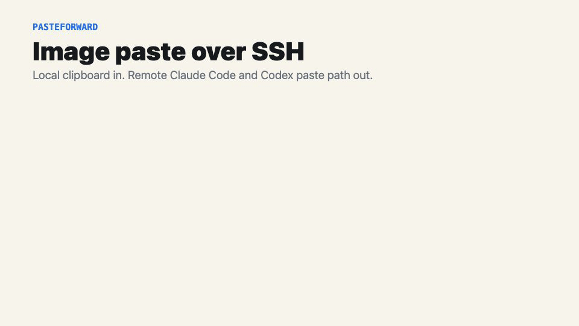

# PasteForward

PasteForward makes image paste work in Claude Code and Codex over SSH.

It runs locally, watches your image clipboard, and forwards each new image to
the clipboard of every configured SSH destination. The terminal agent on the
remote machine keeps using its normal paste path.

## Demo



## Scope

V0 supports:

- local macOS
- local Linux with `wl-paste` or `xclip`
- remote macOS with `osascript` and `pbcopy`
- remote Linux GUI sessions with `wl-copy`/`wl-paste` or `xclip`
- one local daemon that handles all enabled destinations
- JSON config
- metadata history by default
- opt-in image history
- remote image cache under `/tmp/pasteforward`

V0 does not support headless Linux native image paste. Headless remotes need a
path-injection transport, not clipboard mirroring.

## Install From Source

Requires Rust 1.85+.

Install with Cargo to `~/.cargo/bin`:

```sh
cargo install --path . --locked --force
```

Or install to `~/.local/bin`:

```sh
make install
```

## Quick Start

Add a destination and install the background service:

```sh
pasteforward init macmini --host user@mac.example
```

`init` writes config, runs doctor checks, then asks whether to install or restart
the local background service. The default answer is yes.

Then use your normal SSH session. PasteForward keeps forwarding images in the
background:

```sh
ssh user@mac.example
claude
```

Copy a screenshot locally, focus the remote terminal, and press the normal image
paste shortcut used by the remote tool. The daemon updates the remote clipboard;
the terminal agent does not need to know PasteForward exists.

## Commands

```sh
pasteforward init <dest> --host <ssh-host>
pasteforward doctor [dest]
pasteforward status [dest]
pasteforward delete <dest> [--purge]
pasteforward list
pasteforward history [dest]
pasteforward cleanup [dest]
pasteforward install-service <dest> --host <ssh-host>
pasteforward uninstall-service <dest> [--purge]
pasteforward daemon
pasteforward --version
```

`daemon` is mostly for debugging. Normal users should start it through `init`.

Non-interactive service setup requires an explicit flag:

```sh
pasteforward init macmini --host user@mac.example --yes
```

## Linux GUI Notes

Linux clipboard forwarding depends on the remote GUI session being reachable from
SSH. If needed, set explicit remote environment values:

```sh
pasteforward init devbox \
  --host user@devbox \
  --remote-mode linux-x11 \
  --remote-env DISPLAY=:0
```

Wayland sessions may need `WAYLAND_DISPLAY` and `XDG_RUNTIME_DIR`.

## Verification

```sh
make verify
```

This runs formatting checks, tests, build, and supply-chain checks.

On macOS with Lima installed, run the Linux integration tests:

```sh
scripts/test-lima-x11.sh
scripts/test-lima-wayland.sh
```

Those tests create or start a Lima Ubuntu VM and verify local PNG clipboard
bytes reach remote X11 and Wayland clipboards.

Additional release smoke checks:

```sh
scripts/test-ttl-cleanup.sh
scripts/test-fanout.sh
scripts/test-release-tarball.sh
PASTEFORWARD_SERVICE_TEST_HOST=user@host \
  PASTEFORWARD_SERVICE_RESTORE_BIN="$HOME/.local/bin/pasteforward" \
  scripts/test-service-lifecycle.sh
```

`scripts/test-fanout.sh` uses Lima destinations by default. To include a real
macOS SSH destination in the same fan-out run, set
`PASTEFORWARD_MAC_HOST=user@mac.example`.

Before release, also run the real terminal-agent path over a normal SSH session:

```sh
ssh user@mac.example
claude
codex
```

## Docs

- [Contracts](docs/contracts.md)
- [Architecture](docs/architecture.md)
- [Agent usage](docs/agent-usage.md)
- [Onboarding](docs/onboarding.md)
- [Release](docs/release.md)
- [Security and supply chain](docs/security.md)

## License

MIT. See [LICENSE](LICENSE).
